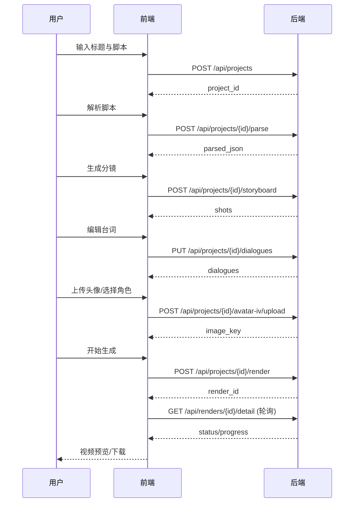
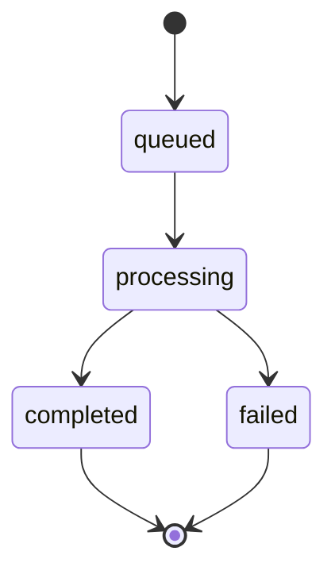

# txt2video 设计文档（现有功能设计可复现）

版本：v0.1

目标：描述当前功能的产品体验、交互流程、页面布局与信息结构，使其他 AI 可复现相同体验。

---

## 1. 产品定位
- 面向：想快速把“故事脚本”转换为短视频的用户
- 核心价值：低门槛、一键化、低成本
- 风格方向：卡通风（MVP）

---

## 2. 用户流程（E2E）
1) 用户进入首页，输入标题与脚本文本
2) 创建项目后进入项目页
3) 点击“解析脚本”并生成分镜
4) 用户在台词编辑区修改内容
5) 可选择 HeyGen 角色/音色
6) 上传 Avatar IV 图片
7) 选择背景模板 & 是否按分镜生成
8) 点击“开始生成”
9) 进入渲染页，查看阶段进度与片段进度
10) 视频完成后直接预览/下载

---

## 3. 页面结构
### 3.1 首页 `/`
- 卡片 1：项目标题输入
- 卡片 2：脚本输入（大文本框）
- 主按钮：创建项目
- 反馈：显示 project_id

### 3.2 项目页 `/project/[id]`
**卡片 1：解析与分镜**
- 按钮：解析脚本
- 按钮：生成分镜
- 输出：解析 JSON

**卡片 2：台词编辑**
- 列表：每行 speaker + text
- 按钮：保存台词
- 按钮：开始生成
- 反馈：render_id

**卡片 3：角色素材（HeyGen）**
- 按钮：加载 HeyGen 角色/音色
- 下拉选择：avatar_id
- 下拉选择：voice_id
- 头像上传：本地预览
- Avatar IV 上传：生成 image_key
- 背景模板选择：paper/mint/sky/sunset
- 开关：按分镜生成 Avatar IV

### 3.3 渲染页 `/render/[id]`
- 展示：状态 + 进度百分比
- 展示：阶段（phase）
- 展示：片段进度（current/total）
- 视频预览：HTML5 video
- 下载链接

---

## 4. 交互细节
- 所有按钮为立即触发；失败返回错误文本
- 解析、分镜不阻塞台词编辑
- Avatar IV 上传后立即显示 image_key
- 上传头像后立即显示预览
- 渲染页轮询 1.5 秒刷新状态

---

## 5. 视觉规范（当前实现）
- 背景：米色纸张风 `#f7f4ef`
- 文字：深灰 `#2b2b2b`
- 强调色：橙色 `#ff7a00`
- 卡片：白色轻边框
- 字体：Noto Serif / Source Han Serif SC

---

## 6. 组件与样式规范
- `card`：白底圆角块，16px padding
- `row`：flex + gap
- 按钮：主色（橙色），次按钮为深灰
- 输入框：圆角 + 边框

---

## 7. 状态与反馈
- 错误反馈：卡片内小字显示错误
- 渲染状态：显示阶段与进度
- 完成后：直接展示视频预览

---

## 8. 可扩展点（保持一致风格）
- 增加角色库/模板库：放在“角色素材”卡片下方
- 增加更多背景模板：使用相同颜色变量体系
- 增加镜头细节编辑：插入在台词卡片之后


---

## 9. 设计时序图（用户视角）


---

## 10. 状态机（渲染任务）


---

## 11. 组件层级图（前端）
```mermaid
graph TD
  A[RootLayout] --> B[HomePage (/)]
  A --> C[ProjectPage (/project/[id])]
  A --> D[RenderPage (/render/[id])]

  C --> C1[解析/分镜卡片]
  C --> C2[台词编辑卡片]
  C --> C3[角色素材卡片]
  C3 --> C31[HeyGen 角色选择]
  C3 --> C32[Avatar IV 上传]
  C3 --> C33[背景模板选择]
  C3 --> C34[分镜开关]

  D --> D1[进度展示]
  D --> D2[视频预览]
```


---

## 12. 信息架构图（IA）
```mermaid
graph TD
  Root[txt2video]
  Root --> Home[首页 /]
  Root --> Project[项目页 /project/[id]]
  Root --> Render[渲染页 /render/[id]]

  Home --> HomeA[创建项目]
  HomeA --> HomeA1[标题]
  HomeA --> HomeA2[脚本输入]

  Project --> P1[解析脚本]
  Project --> P2[分镜生成]
  Project --> P3[台词编辑]
  Project --> P4[角色素材]
  Project --> P5[渲染入口]

  P4 --> P41[HeyGen 角色选择]
  P4 --> P42[HeyGen 音色选择]
  P4 --> P43[Avatar IV 上传]
  P4 --> P44[背景模板]
  P4 --> P45[按分镜开关]

  Render --> R1[进度状态]
  Render --> R2[阶段信息]
  Render --> R3[片段进度]
  Render --> R4[视频预览]
  Render --> R5[下载链接]
```

