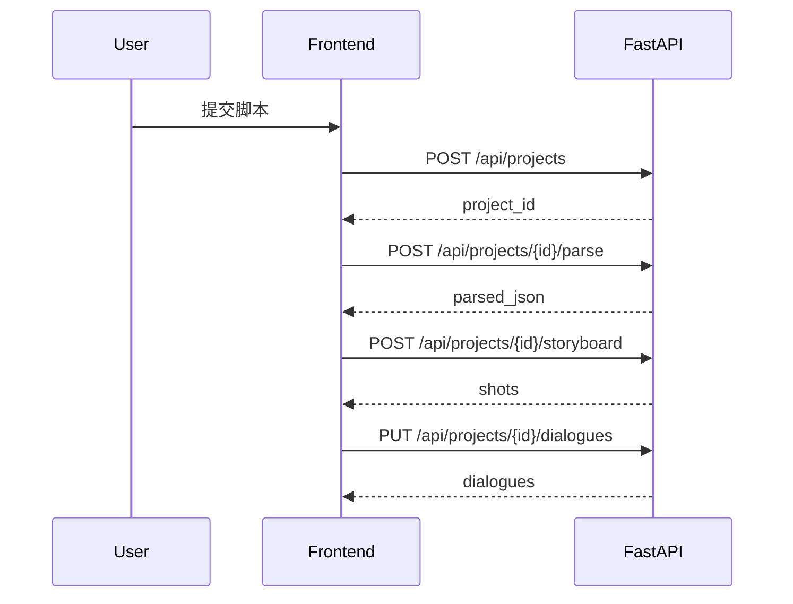
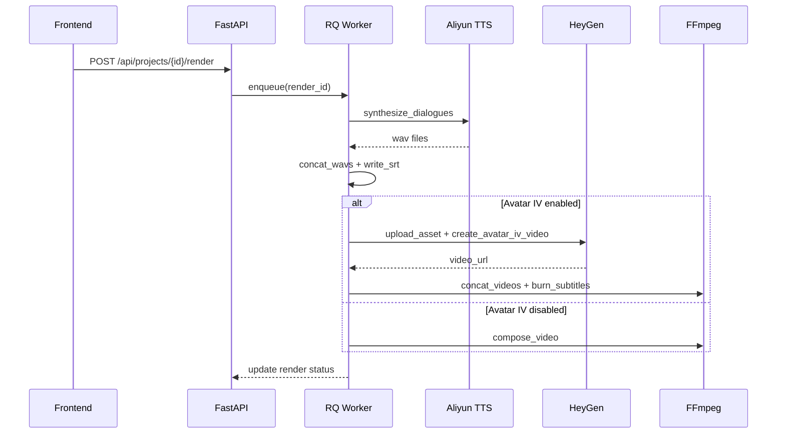

# txt2video 开发文档（现有功能可复现实现）

版本：v0.1（基于当前仓库实现）

目标：任何工程师或 AI 仅凭此文档即可从零实现当前功能集（后端+前端+队列+合成）。

---

## 1. 功能清单（当前已实现）
- 创建项目并上传脚本文本
- 脚本解析为结构化 JSON（场景/台词）
- 基于台词生成基础分镜
- 前端台词编辑保存
- 任务队列渲染：TTS → 合并音频 → 生成字幕 → 合成视频
- 阿里云 TTS（失败降级为静音 wav）
- Avatar IV：上传图片生成 image_key，渲染时按台词或分镜逐句生成视频片段并拼接
- HeyGen 口型（备用方案）：基于 audio_url + avatar_id 生成
- 渲染状态详情：阶段 + 分片进度
- 前端进度轮询 + 视频预览/下载

---

## 2. 系统依赖
- Python 3.10+
- Node.js 18+
- Redis
- FFmpeg

macOS 安装参考：
```bash
brew install redis ffmpeg
```

---

## 3. 环境变量
### 3.1 后端 `api/.env`
```
REDIS_URL=redis://localhost:6379/0
TTS_PROVIDER=aliyun
ALIYUN_ACCESS_KEY_ID=xxx
ALIYUN_ACCESS_KEY_SECRET=xxx
ALIYUN_APPKEY=xxx
ALIYUN_REGION=ap-southeast-1

LIP_SYNC_PROVIDER=heygen
PUBLIC_BASE_URL=https://your-public-domain
HEYGEN_API_KEY=xxx
HEYGEN_AVATAR_ID=xxx
```

### 3.2 前端 `web/.env.local`
```
NEXT_PUBLIC_API_BASE=http://localhost:8000
```

---

## 4. 启动流程
### 后端
```bash
python -m venv .venv
source .venv/bin/activate
pip install -r api/requirements.txt
cp api/.env.example api/.env
uvicorn api.app.main:app --reload
```

### 队列
```bash
python -m rq worker txt2video
```

### 前端
```bash
cd web
cp .env.local.example .env.local
npm install
npm run dev
```

---

## 5. 数据模型（SQLite）
表结构要求：
- projects(id, title, created_at)
- scripts(id, project_id, raw_text, parsed_json)
- dialogues(id, project_id, speaker, text, audio_path)
- shots(id, project_id, shot_index, description, duration_sec)
- renders(id, project_id, status, progress, output_video_path, created_at)
- project_settings(id, project_id, avatar_id, voice_id, avatar_image_path, avatar_iv_image_key, background_style, use_shots_for_avatar_iv)
- system_settings(id, tts_provider, enable_heygen, enable_avatar_iv)
  - + encrypted keys: aliyun_access_key_id_enc, aliyun_access_key_secret_enc, aliyun_appkey_enc
  - + encrypted keys: heygen_api_key_enc
  - + encrypted keys: volcengine_app_id_enc, volcengine_token_enc, volcengine_cluster_enc
  - + volcengine_voice_type

备注：
- SQLite 文件存放：`api/app/storage/app.db`
- 新字段变更时需迁移或删除旧 db

---

## 6. API 规范（必须实现）
### Projects
- `POST /api/projects`
  - 入参：`{ title, raw_text }`
  - 出参：`{ id, title }`

- `POST /api/projects/{id}/parse`
  - 解析脚本，写入 scripts.parsed_json
  - 同时写入 dialogues（按台词拆行）

- `POST /api/projects/{id}/storyboard`
  - 生成 shots（按台词拆镜头）

- `PUT /api/projects/{id}/dialogues`
  - 保存台词列表

- `GET /api/projects/{id}/dialogues`

- `GET /api/projects/{id}/settings`
- `PUT /api/projects/{id}/settings`
  - avatar_id
  - voice_id
  - avatar_iv_image_key
  - background_style
  - use_shots_for_avatar_iv (bool)

- `POST /api/projects/{id}/avatar`
  - 上传本地头像（仅预览）

- `POST /api/projects/{id}/avatar-iv/upload`
  - 上传图片至 HeyGen Upload Asset
  - 返回 image_key
  - 同步保存为本地头像

### Renders
- `POST /api/projects/{id}/render`
  - 创建 render 记录并入队

- `GET /api/renders/{render_id}/status`
- `GET /api/renders/{render_id}/detail`
  - 返回阶段与分片进度（读取 status.json）

- `GET /api/renders/{render_id}/download`

### Assets
- `GET /api/assets/audio/{render_id}/{filename}`
  - 提供给 HeyGen 访问

- `GET /api/assets/avatar/{project_id}`
  - 本地头像预览

### HeyGen
- `GET /api/heygen/avatars`
- `GET /api/heygen/voices`

---

## 7. 渲染任务规范（核心实现）
文件：`api/app/tasks/worker.py`

渲染步骤：
1) 读取 dialogues
2) TTS 生成每句音频（阿里云 / 失败降级为静音）
3) 合并音频为 merged.wav
4) 生成 subtitles.srt
5) 若启用 Avatar IV：
   - 以台词或分镜为片段生成 Avatar IV 视频
   - 逐片下载 mp4
   - ffmpeg concat 拼接
   - burn_subtitles 烧录字幕
6) 否则用 FFmpeg 生成纯色背景视频 + 音频 + 字幕
7) 状态更新：status.json + renders 表

进度上报：
- 15%: tts
- 45%: tts_done
- 65%: subtitles
- 80%: compose
- 80–100%: avatar_iv 分片进度

---

## 8. 阿里云 TTS 实现
文件：`api/app/services/tts.py`
- 通过 CreateToken 生成 token
- 调用 RESTful TTS（wav/16k）
- 失败降级为静音 wav

若替换为其他 TTS：
- 保持 `synthesize_dialogues(dialogues, output_dir)` 接口返回 list(TTSLineResult)

---

## 9. HeyGen Avatar IV 实现
文件：`api/app/services/heygen.py`
- `upload_asset()` 上传图片获得 image_key
- `create_avatar_iv_video()` 传入 image_key + script + voice_id
- `wait_for_video()` 轮询获取 video_url
- `download_video()` 下载 mp4

---

## 10. FFmpeg 合成
文件：`api/app/tasks/compose.py`
- `compose_video()`：纯色视频 + 音频 + 字幕
- `concat_videos()`：拼接 Avatar IV 片段
- `burn_subtitles()`：给拼接视频烧录字幕

---

## 11. 前端页面规范
### `/`
- 表单：title + raw_text
- 创建项目后显示 project_id

### `/project/[id]`
- 解析脚本
- 生成分镜
- 台词编辑
- HeyGen 角色/音色选择
- Avatar IV 上传
- 背景模板选择
- Avatar IV 按分镜开关
- 触发渲染

### `/render/[id]`
- 轮询 `/detail`
- 展示 phase/current/total
- 视频预览 + 下载

---

## 12. 本地调试建议
- 删除 `api/app/storage/app.db` 以应用新 schema
- 用短文本测试 Avatar IV（避免大额消耗）


---

## 13. 接口契约（Request/Response 细节）
### 通用约定
- `Content-Type: application/json`
- 错误响应格式：
```json
{ "detail": "error message" }
```

### 13.1 POST /api/projects
**请求**
```json
{ "title": "我的故事", "raw_text": "# 公园\n小明: 你好" }
```
**响应**
```json
{ "id": 1, "title": "我的故事" }
```

### 13.2 POST /api/projects/{id}/parse
**响应**
```json
{
  "scenes": [
    {
      "scene_id": 1,
      "location": "公园",
      "characters": ["小明"],
      "dialogue": [
        { "speaker": "小明", "text": "你好" }
      ]
    }
  ]
}
```

### 13.3 POST /api/projects/{id}/storyboard
**响应**
```json
[
  { "shot_id": 1, "shot_index": 1, "description": "小明对话：你好", "duration_sec": 3 }
]
```

### 13.4 PUT /api/projects/{id}/dialogues
**请求**
```json
{ "dialogues": [ { "speaker": "小明", "text": "你好" } ] }
```
**响应**
```json
[ { "id": 1, "speaker": "小明", "text": "你好", "audio_path": null } ]
```

### 13.5 GET /api/projects/{id}/dialogues
**响应**
```json
[ { "id": 1, "speaker": "小明", "text": "你好", "audio_path": null } ]
```

### 13.6 GET /api/projects/{id}/settings
**响应**
```json
{
  "avatar_id": "av_123",
  "voice_id": "voice_abc",
  "avatar_image_url": "/api/assets/avatar/1",
  "avatar_iv_image_key": "img_456",
  "background_style": "paper",
  "use_shots_for_avatar_iv": true
}
```

### 13.7 PUT /api/projects/{id}/settings
**请求**
```json
{ "avatar_id": "av_123", "voice_id": "voice_abc", "background_style": "mint" }
```
**响应**同 13.6

### 13.8 POST /api/projects/{id}/avatar
**请求**
- multipart/form-data: file

**响应**
```json
{ "ok": true }
```

### 13.9 POST /api/projects/{id}/avatar-iv/upload
**请求**
- multipart/form-data: file

**响应**
```json
{ "image_key": "img_456" }
```

### 13.10 POST /api/projects/{id}/render
**响应**
```json
{ "render_id": 12 }
```

### 13.11 GET /api/renders/{render_id}/status
**响应**
```json
{ "status": "processing", "progress": 60, "output_video_path": null }
```

### 13.12 GET /api/renders/{render_id}/detail
**响应**
```json
{
  "status": "processing",
  "progress": 85,
  "detail": { "phase": "avatar_iv", "current": 3, "total": 6, "progress": 85 },
  "output_video_path": null
}
```

### 13.13 GET /api/renders/{render_id}/download
**响应**
- `video/mp4` 文件流

### 13.14 GET /api/heygen/avatars
**响应**
```json
{ "data": [ { "avatar_id": "...", "name": "..." } ] }
```

### 13.15 GET /api/heygen/voices
**响应**
```json
{ "data": [ { "voice_id": "...", "name": "..." } ] }
```

### 13.16 系统设置
- `GET /api/settings`
- `PUT /api/settings`
```json
{ "tts_provider": "aliyun", "enable_heygen": true, "enable_avatar_iv": true }
```

### 13.17 TTS Provider 约定
- `aliyun`：阿里云语音合成
- `volcengine`：火山引擎语音合成
- `mock`：静音占位

### 13.18 配置测试接口
- `POST /api/settings/test/tts`
- `POST /api/settings/test/heygen`

---

## 14. 错误码与失败场景
**统一错误格式**
- HTTP 状态码 + JSON `{ "detail": "..." }`

**常见错误**
- 404: project/render/asset not found
- 400: third-party API error
- 500: 任务执行中断

**失败降级**
- TTS 失败：使用静音 wav
- HeyGen 失败：回退 FFmpeg 合成

---

## 15. 时序图（核心流程）
### 15.1 脚本解析 → 分镜 → 台词


### 15.2 渲染任务流程


---

## 16. JSON Schema（关键对象）
### Dialogue
```json
{ "speaker": "string", "text": "string" }
```

### Shot
```json
{ "shot_index": 1, "description": "string", "duration_sec": 3 }
```

### RenderDetail
```json
{ "phase": "string", "current": 0, "total": 0, "progress": 0 }
```
